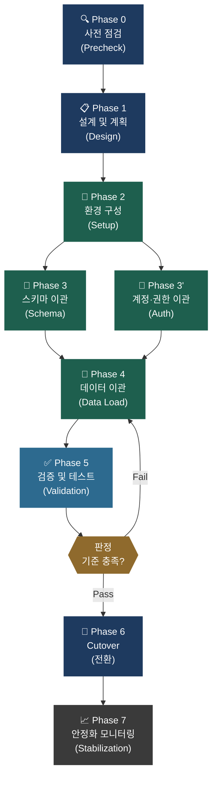

# EDB EPAS → PostgreSQL 마이그레이션 계획서

> **프로젝트**: SAMPLE_DB 데이터베이스 마이그레이션  
> **분석 기준**: `epas_precheck_v3.0.sh` v3.0 결과 데이터  
> **문서 버전**: v1.0  
> **작성일**: 2026-04-09  
> **문서 상태**: ✅ 검토 완료 · 배포 가능

---

## 📋 목차

| # | 문서 | 설명 |
| :---: | :--- | :--- |
| — | [Executive Summary](#-executive-summary) | 프로젝트 목표 및 전체 흐름 |
| DOC-1 | [호환성 분석 보고서](#doc-1--호환성-분석-보고서) | Precheck 결과 기반 위험 요소 정량화 |
| DOC-2 | [DB · 유저 · 권한 이관 계획서](#doc-2--db--유저--권한-이관-계획서) | 사용자 계정 및 보안 정책 이관 |
| DOC-3 | [스키마 객체 이관 계획서](#doc-3--스키마-객체-이관-계획서) | 테이블 · 인덱스 · 뷰 등 DDL 변환 |
| DOC-4 | [데이터 이관 계획서](#doc-4--데이터-이관-계획서) | 실데이터 복제 전략 및 검증 방안 |
| DOC-5 | [프로그램 객체 튜닝 계획서](#doc-5--프로그램-객체-튜닝-계획서) | PL/SQL → PL/pgSQL 변환 가이드 |
| — | [전체 마이그레이션 프로세스](#-전체-마이그레이션-프로세스) | Phase 0~7 단계별 워크플로우 |
| — | [품질 보증 전략](#-품질-보증-전략-qa) | 3-Layer 검증 체계 |
| — | [RACI 매트릭스](#-프로젝트-담당자-매트릭스-raci) | 역할 및 책임 정의 |
| — | [부록](#-부록) | TSV 매핑 테이블 · 파일명 규칙 |

---

## 🎯 Executive Summary

본 마이그레이션 프로젝트는 EDB EPAS(EnterpriseDB Advanced Server)에서 운영 중인 **SAMPLE_DB**를 커뮤니티 기반의 표준 **PostgreSQL**로 전환합니다.

프로젝트는 총 **8단계(Phase 0 ~ Phase 7)** 로 구성되며, 각 단계는 명확한 **산출물(Deliverable)** 및 **담당 주체**를 갖습니다.  
`epas_precheck_v3.0.sh` 사전 점검 결과를 기반으로 리스크를 정량화하여, **데이터 유실 0건** 및 **서비스 중단 최소화**를 핵심 목표로 합니다.

### 핵심 위험 요약

| 위험 등급 | 주요 이슈 | 영향 범위 |
| :---: | :--- | :--- |
| 🔴 **HIGH** | Redaction 정책 (네이티브 미지원), DBLink (Oracle 연동), 호환 불가 패키지 (`dbms_crypto`) | 보안·연동 아키텍처 재설계 필요 |
| 🟡 **MEDIUM** | EDB 전용 파라미터, CLOB/BFILE 타입, 표현식(SYSDATE, NVL 등) | DDL 변환 및 애플리케이션 수정 필요 |
| 🟢 **LOW** | 통계/튜닝 관련 파라미터, 기타 설정 | 이관 후 재검토 권장 수준 |

---

## DOC-1 · 호환성 분석 보고서

> **분석 기준**: `epas_precheck_v3.0.sh` 결과 데이터 (`.result_sample`)  
> **점검 일시**: 2026-04-02

### 1. 종합 현황 요약 (Summary Scorecard)

| 항목 | 전체 건수 | 🔴 HIGH | 🟡 MEDIUM | 🟢 LOW |
| :--- | :---: | :---: | :---: | :---: |
| **파라미터** | 7 | 0 | 7 | 0 |
| **패밀리/패키지/객체** | 29 | 15 | 10 | 4 |
| **데이터타입 (테이블/컬럼)** | 8 | 0 | 8 | 0 |
| **표현식 (DEFAULT/INDEX)** | 12 | 5 | 7 | 0 |
| **보안 정책 (RLS/Redaction)** | 4 | 4 | 0 | 0 |
| **DBLink** | 3 | 1 | 2 | 0 |

> [!IMPORTANT]
> **Redaction 정책** 및 **DBLink(Oracle 연동)** 항목에서 PostgreSQL 네이티브 기능으로 대체 불가능한 요소가 발견되었습니다. 해당 항목에 대한 별도의 아키텍처 설계가 필요합니다.

### 2. 위험도 정의 기준

| 위험도 | 판단 기준 | 예시 항목 |
| :---: | :--- | :--- |
| 🔴 **HIGH** | PostgreSQL에서 동작 불가 또는 기능 자체 없음 | `edb_audit`, `Redaction`, `DBLink`, `ROWID` |
| 🟡 **MEDIUM** | 동작하나 결과 차이 발생 가능 | `NVL`, `DECODE`, `SYSDATE`, `DBMS_*`, `edb_redwood_strings` |
| 🟢 **LOW** | 이관 후 재검토 권장 수준 | `timed_statistics`, `edb_dynatune` |

### 3. 주요 섹션별 세부 분석

#### 3.1 EDB 전용 파라미터 (`01_parameters.tsv`)

**위험도**: 🟡 MEDIUM

- **현황**: `db_dialect=redwood`, `edb_redwood_strings=on`, `edb_redwood_date=on` 등 오라클 호환 모드가 활성화되어 있습니다.
- **분석**: PostgreSQL 전환 시 기본 문자열 처리(NULL vs Empty) 및 날짜 타입 동작 방식의 차이로 인해 애플리케이션 로직 수정이 필요할 수 있습니다.
- **권장**: 단계적 `db_dialect=postgres` 전환 테스트를 권장합니다.

#### 3.2 호환 불가 패키지 사용 현황 (`02_summary_packages.tsv`)

**위험도**: 🔴 HIGH

- **주요 발견**: `dbms_crypto`, `utl_raw`, `dbms_output` 등이 사용 중입니다.
- **분석**:
    - `dbms_crypto`: PostgreSQL의 `pgcrypto` 확장 모듈로 마이그레이션이 필요합니다.
    - `utl_raw`: `bytea` 타입 처리 함수로 변환이 필요합니다.
- **대상 객체**: `fn_decrypt`, `fn_encrypt`, `proc_generate_crypto_data` 등

#### 3.3 비호환 데이터타입 (`03_detail_datatypes_tables.tsv`)

**위험도**: 🟡 MEDIUM

- **현황**: `bfile`, `clob` 타입을 사용하는 테이블 8개가 식별되었습니다.
- **분석**: PostgreSQL에서는 `bfile`을 지원하지 않으므로 파일 경로 문자열로 저장하고 앱에서 처리하거나, `clob`은 `text` 타입으로 변환해야 합니다.
- **대상**: `tb_employee_info`, `tb_datatype_test` 등

#### 3.4 데이터 Redaction 정책 (`02_summary_redaction.tsv`)

**위험도**: 🔴 HIGH

- **현황**: `mask_phone_policy` 등 4개의 Redaction 정책이 `public` 및 `sc_redact` 스키마에 존재합니다.
- **분석**: PostgreSQL은 네이티브 Data Redaction 기능을 제공하지 않습니다. `VIEW` 또는 `App 레벨`에서 마스킹 처리를 수행하도록 **재설계가 필수**입니다.

#### 3.5 DBLink 현황 (`04_policy_edb_dblink.tsv`)

**위험도**: 🔴 HIGH

- **발견**: `oralink` (Oracle 연동), `pg16_link` (PostgreSQL 연동)
- **분석**: `oracle_fdw` 및 `postgres_fdw` 설치 및 설정이 필요합니다. 특히 Oracle 연동은 Oracle Client 라이브러리 설치 등 추가 작업이 수반됩니다.

### 4. 결론 및 권장 조치

1. **패키지 변환**: 암호화 관련 함수(`dbms_crypto`)의 재작성 공수가 높으므로 조기에 변환 가이드 배포가 필요합니다.
2. **보안 재설계**: Redaction 정책을 사용하는 테이블(`tb_redaction_test`)에 대해 마스킹 전용 뷰 생성을 검토하십시오.
3. **데이터타입**: `bfile` 컬럼의 실데이터 존재 여부 및 외부 파일 관리 방식에 대한 실사가 필요합니다.

---

## DOC-2 · DB · 유저 · 권한 이관 계획서

> **분석 기준**: `pg_roles`, `edb_profile`, `edb_resource_group` 기반 분석 결과

### 1. 개요

EDB EPAS에서 운영 중인 사용자 계정, 권한 체계, 보안 정책(Profile) 및 리소스 관리 정책을 PostgreSQL 환경으로 안전하게 이관하기 위한 절차를 정의합니다.

### 2. 사용자 및 데이터베이스 현황

#### 2.1 이관 대상 데이터베이스

- **DB명**: `SAMPLE_DB`
- **Encoding**: `UTF-8`
- **Locale**: `C`

#### 2.2 이관 대상 사용자 (Roles)

| 사용자명 | 권한 수준 | 이관 전략 | 비고 |
| :--- | :--- | :--- | :--- |
| `kim` | Normal | DDL 생성 시 포함 | `P2` 프로파일 적용 중 |
| `testuser` | Normal | DDL 생성 시 포함 | `P2` 프로파일 적용 중 |
| `t1` | Normal | DDL 생성 시 포함 | `PROF_MIG_01` 적용 중 |
| `dsg_user` | Normal | DDL 생성 시 포함 | `rg_test_50` 리소스 그룹 적용 중 |
| `enterprisedb` | Superuser | **제외** (PG 기본 superuser 사용) | 시스템 계정 |

### 3. 보안 정책(Profile) 이관 계획 (`04_policy_edb_profile.tsv`)

EDB 전용 프로파일 기능을 PostgreSQL의 운영 정책이나 확장 모듈로 매핑합니다.

| EDB Profile | 주요 설정 | PostgreSQL 대응 방안 |
| :--- | :--- | :--- |
| `P2` | `FAILED_LOGIN_ATTEMPTS: 2`, `PASSWORD_LIFE_TIME: 1` | `auth_delay` 확장 사용 및 OS 스크립트로 잠금 처리 |
| `PROF_MIG_01` | `FAILED_LOGIN_ATTEMPTS: 3` | 운영 거버넌스 가이드에 따른 수동 제어 |
| `TEST_MIG_PROFILE` | `PASSWORD_LIFE_TIME: 90` | `pg_password_check` 확장 기능 검토 |

### 4. 리소스 관리 정책 이관 (`04_policy_edb_resource_group.tsv`)

| EDB Resource Group | 설정값 (CPU %) | PostgreSQL 대응 방안 |
| :--- | :--- | :--- |
| `rg_mig_10` | 100% | 기본 스케줄러 사용 (제한 불필요 시) |
| `rg_test_50` | 50% | `Linux Cgroups` 연계 또는 `pgrca` 확장 검토 |

### 5. 권한(Grant/Revoke) 이관 방안

#### 5.1 스키마/테이블 권한

- `public`, `sc_crypto`, `sc_redact` 스키마에 대한 `USAGE`, `CREATE` 권한을 스크립트화하여 재적용합니다.
- 특정 테이블(`tb_datatype_test` 등)에 부여된 개별 권한을 전수 추출하여 이관합니다.

#### 5.2 암호 처리 절차

1. PG 환경에서 사용자 Role 생성 (Nologin/NoPassword 상태)
2. 초기 임시 패스워드 설정 후 `ALTER ROLE` 수행
3. 사용자의 최초 접속 시 비밀번호 변경 강제화 정책 (`ALTER ROLE ... PASSWORD '...' EXPIRE`) 적용 검토

### 6. 특이사항 및 주의사항

> [!WARNING]
> - **Superuser 권한**: EDB의 `enterprisedb` 계정만 가능한 작업들이 PG에서는 `postgres` 계정 또는 특정 사전정의 롤(`pg_monitor` 등)로 분산되어야 할 수 있습니다.
> - **감사(Audit)**: `edb_audit`을 활용 중인 경우, `pgAudit` 확장 모듈 설치 및 로깅 레벨 설정을 DOC-2의 부속 작업으로 수행해야 합니다.
> - **연결 제한**: 각 사용자별 `CONNECTION LIMIT`은 서비스 용량 산정 결과에 따라 재조정될 수 있습니다.

---

## DOC-3 · 스키마 객체 이관 계획서

> **분석 기준**: `raw_tables_columns`, `03_detail_datatypes_tables`, `03_detail_expr_keywords`

### 1. 개요

EDB EPAS에서 운영 중인 테이블, 인덱스, 뷰, 제약조건 등 주요 스키마 객체를 PostgreSQL 네이티브 구문으로 변환하여 이관하기 위한 가이드라인 및 대상 목록을 정의합니다.

### 2. 데이터타입 변환 계획

#### 2.1 주요 변환 대상 테이블

PostgreSQL에서 지원하지 않는 구형 EDB 타입(`CLOB`, `BFILE`)을 사용하는 테이블입니다.

| 스키마 | 테이블명 | 영향 컬럼 | 현재 타입 | 변환 타입 | 비고 |
| :--- | :--- | :--- | :--- | :--- | :--- |
| `public` | `clob_test` | `id` | `CLOB` | `TEXT` | |
| `public` | `t11`, `t12` | `c1`, `c5` | `BFILE`/`CLOB` | `TEXT`/`VARCHAR` | 파일 경로는 앱 처리 권장 |
| `public` | `tb_datatype_test` | `test_bfile`, `test_clob` | `BFILE`/`CLOB` | `VARCHAR`/`TEXT` | |
| `public` | `tb_employee_info` | `external_cert`, `resume_doc` | `BFILE`/`CLOB` | `VARCHAR`/`TEXT` | |

#### 2.2 공통 데이터타입 매핑 기준

| 구분 | EDB/Oracle 타입 | PostgreSQL 타입 | 변환 권고 |
| :--- | :--- | :--- | :--- |
| 문자열 | `VARCHAR2(n)` | `VARCHAR(n)` or `TEXT` | `n`이 큰 경우 `TEXT` 권장 |
| 날짜 | `DATE` | `TIMESTAMP` | `edb_redwood_date=on` 기준 |
| 대용량 | `CLOB` | `TEXT` | 자동 매핑 지원 |
| 바이너리 | `RAW(n)` | `BYTEA` | 16진수 입력 방식 확인 |

### 3. 표현식 및 제약조건 변환 계획

#### 3.1 DEFAULT 제약조건 변환

| 테이블명 | 대상 컬럼 | 현재 표현식 | 변환 후 표현식 |
| :--- | :--- | :--- | :--- |
| `a5`, `tb_ddl_migration_test` | `reg_date`, `created_at` | `SYSDATE` | `CURRENT_TIMESTAMP` |
| `epas_emp_contracts` | `contract_date` | `SYSTIMESTAMP` | `CURRENT_TIMESTAMP` |
| `user_secure_data` | `created_at` | `SYSDATE` | `CURRENT_TIMESTAMP` |

#### 3.2 CHECK 제약조건 변환

| 테이블명 | 제약조건명 | 비호환 구문 | 조치 방안 |
| :--- | :--- | :--- | :--- |
| `tb_ddl_migration_test` | `chk_emp_id_valid` | `NVL(col, val)` | `COALESCE(col, val)`로 재작성 |
| `tb_ddl_migration_test` | `chk_emp_status` | `DECODE(...)` | `CASE WHEN...END`로 재작성 |

### 4. 인덱스 및 기타 객체 변환 계획

#### 4.1 함수 기반 인덱스 (Expression Index)

- **대상**: `tb_ddl_migration_test`의 `idx_created_at_add_months`
- **현재**: `ADD_MONTHS(created_at, 12)`
- **변환**: `(created_at + INTERVAL '12 months')`

#### 4.2 시노님(Synonym) 대체 방안

분석 결과 식별된 시노님들은 다음 중 하나의 방안으로 대체합니다.

1. **Schema Search Path**: `SET search_path TO ...`를 통해 앱 레벨에서 탐색 경로 지정
2. **VIEW 생성**: 타 스키마 객체를 참조하는 동일 명칭의 VIEW 생성
3. **직접 매핑**: SQL 쿼리 내에서 `schema.object` 형식으로 Full-qualified name 변경

### 5. 이관 시 주의사항

> [!NOTE]
> - **대소문자 처리**: EDB Redwood 모드에서는 따옴표 없는 대문자 객체명이 소문자로 인식될 수 있으나, PostgreSQL은 소문자가 기본입니다. 이관 스크립트 작성 시 주의가 필요합니다.
> - **Index 중복**: PG 네이티브 이관 툴 사용 시 PK 인덱스와 수동 생성 인덱스가 중복 생성되지 않도록 필터링이 필요합니다.

---

## DOC-4 · 데이터 이관 계획서

> **분석 기준**: `raw_tables_objects`, `pg_stat_user_tables` (추정치)

### 1. 개요

EDB EPAS 서버의 실데이터를 PostgreSQL 운영 환경으로 적기에, 데이터 유실 없이 이관하기 위한 전략 및 검증 방안을 수립합니다.

### 2. 이관 대상 및 예상 데이터 볼륨

전체 약 50여 개의 테이블 중 주요 대용량 대상 및 특수 타입 포함 테이블 현황입니다.

| 스키마 | 테이블명 | 예상 건수 | 예상 용량 | 특이사항 |
| :--- | :--- | :---: | :---: | :--- |
| `public` | `t_bulk_data` | 1,000,000 | 500 MB | 테스트용 벌크 데이터 |
| `public` | `pgbench_accounts` | 100,000 | 15 MB | pgbench 표준 테이블 |
| `public` | `tb_employee_info` | 5,000 | 2 GB | `CLOB`, `BFILE` 포함 (LOB 데이터) |
| `sc_crypto` | `user_secure_data` | 10,000 | 50 MB | `BYTEA` 암호화 데이터 |
| `public` | 기타 소형 테이블 | < 1,000 | < 1 MB | `emp`, `dept`, `a1~a5` 등 |

### 3. 이관 방법론 및 도구 선정

#### 3.1 도구 비교 및 선정 근거

| 구분 | Dump/Restore | pgloader | CDC (Debezium) |
| :--- | :---: | :---: | :---: |
| 서비스 중단 | 필요 | 최소화 가능 | 거의 없음 |
| 비호환 변환 | 수동 | 룰 정의 가능 | 별도 처리 필요 |
| 복잡도 | 낮음 | 중간 | 높음 |
| **권장** | 소규모/단순 | **타입 변환 多** | 무중단 필요 시 |

#### 3.2 선정된 도구

- **pgloader** (주 도구): `VARCHAR2` → `VARCHAR`, `CLOB` → `TEXT` 등 자동 타입 변환 및 벌크 인서트 속도 확보
- **pg_dump / pg_restore** (보조): 순수 PostgreSQL 호환 객체 및 구조 이관
- **Python Custom Script** (특수): `BFILE` 타입의 외부 파일 경로 정규화

### 4. 이관 절차 (Migration Workflow)

1. **사전 준비 (Pre-migration)**
    - 대상 DB 파라미터 최적화 (`max_wal_size`, `maintenance_work_mem` 증설)
    - 타겟 스키마 생성 및 사용자 권한 할당 (DOC-2 참조)
2. **스키마 생성 (Schema-only)**
    - 제약조건(FK) 및 트리거를 제외한 테이블 구조 생성 (DOC-3 참조)
3. **데이터 이관 (Data-only Load)**
    - `pgloader`를 활용한 병렬 데이터 로딩 수행
    - LOB 데이터(CLOB)가 포함된 `tb_employee_info` 등은 별도 세션으로 실행
4. **후속 처리 (Post-migration)**
    - 인덱스 생성, 제약조건(FK) 활성화, 트리거 생성
    - `ANALYZE` 수행을 통한 통계 정보 갱신
    - 시퀀스(Sequence) 현재값 동기화

### 5. 데이터 정합성 검증 방안

| 검증 단계 | 방법 | 성공 판정 기준 |
| :--- | :--- | :--- |
| **건수 검증** | `SELECT COUNT(*)` 비교 | 원천/대상 DB 건수 일치 (오차 0건) |
| **값 검증** | `MIN/MAX/SUM` 비교 | 주요 숫자형 컬럼(salary 등) 합계 일치 |
| **샘플 검증** | 상위/하위 100건 데이터 비교 | 주요 텍스트/바이너리 값 비교 일치 |
| **LOB 검증** | `LENGTH(text_col)` 확인 | CLOB → TEXT 변환 후 글자 수 일치 여부 |

> [!TIP]
> 이관 완료 후 아래 검증 기준을 모두 충족해야 이관 성공으로 판정합니다.  
> 1. 건수 검증 — 원천 COUNT(*) = 대상 COUNT(*), 허용 오차 0%  
> 2. NULL 검증 — NOT NULL 컬럼의 NULL 데이터 없음  
> 3. FK 검증 — 참조 무결성 위배 0건  
> 4. 시퀀스 검증 — LAST_VALUE >= 원천 MAX(PK)

### 6. 장애 대응 및 롤백 계획

- **이관 실패 시**: 타겟 DB 스키마 `DROP` 후 재수행
- **정합성 오류 시**: 오류 테이블 데이터 `TRUNCATE` 후 해당 테이블만 재이관 (`pgloader` 특정 테이블 모드)
- **시간 초과 시**: 인덱스 생성 병렬화(`max_parallel_maintenance_workers`) 수치 상향 조정

---

## DOC-5 · 프로그램 객체 튜닝 계획서

> **분석 기준**: `02_summary_packages_raw`, `03_detail_keywords`

### 1. 개요

EDB EPAS 전용 PL/SQL 구문(edbspl) 및 오라클 호환 내장 패키지를 사용하는 Function, Procedure, Package를 PostgreSQL의 `plpgsql` 표준으로 변환하기 위한 기술 가이드 및 재작성 대상을 정의합니다.

### 2. 주요 재작성 대상 객체 목록

분석 결과 위험도가 높은(🔴 HIGH) 객체들로, **수동 변환 작업이 필수**입니다.

| 스키마 | 객체명 | 타입 | 주요 비호환 요소 | 조치 방향 |
| :--- | :--- | :---: | :--- | :--- |
| `public` | `calc_emp_bonus` | Proc | `DBMS_OUTPUT`, `VARCHAR2`, `edbspl` | `RAISE NOTICE` 변환, `plpgsql` 전환 |
| `public` | `fn_encrypt` | Func | `dbms_crypto.encrypt`, `utl_raw` | `pgcrypto` 확장 모듈 함수로 대체 |
| `public` | `fn_decrypt` | Func | `dbms_crypto.decrypt`, `utl_raw` | `pgcrypto` 확장 모듈 함수로 대체 |
| `sc_crypto` | `proc_generate_crypto_data` | Proc | `RANDOMBYTES`, `HASH`, `ENCRYPT` | `pgcrypto` 기반 로직으로 전면 재작성 |
| `public` | `fn_migration_test` | Func | `user_tables`, `nvl`, `decode` | `information_schema` 및 `CASE`문 변환 |

### 3. 변환 가이드라인 (edbspl → plpgsql)

#### 3.1 구문 및 언어 선언

- **변경**: `LANGUAGE edbspl` → `LANGUAGE plpgsql`
- **구조**: `DECLARE` 섹션과 `BEGIN...END;` 블록을 명확히 구분합니다.

#### 3.2 내장 패키지 대체 매핑

| EDB/Oracle 패키지 | PostgreSQL 대응 (plpgsql) |
| :--- | :--- |
| `DBMS_OUTPUT.PUT_LINE(msg)` | `RAISE NOTICE '%', msg;` |
| `DBMS_CRYPTO.ENCRYPT(...)` | `pgcrypto.encrypt(...)` 또는 `encrypt_iv(...)` |
| `UTL_RAW.CAST_TO_RAW(str)` | `str::bytea` (캐스팅) |
| `UTL_RAW.CAST_TO_VARCHAR2(raw)` | `encode(raw, 'escape')` 또는 `convert_from` |
| `SYS_CONTEXT('USERENV', ...)` | `current_setting(...)` 또는 `current_user` |
| `RAISE_APPLICATION_ERROR` | `RAISE EXCEPTION USING ERRCODE=...` |
| `SQLCODE` / `SQLERRM` | `SQLSTATE` / `SQLERRM` |
| `SYSDATE` | `CURRENT_TIMESTAMP` or `NOW()` |
| `NVL(a, b)` | `COALESCE(a, b)` |
| `DECODE(x, v1, r1, ...)` | `CASE WHEN ... END` |
| `ROWNUM` | `ROW_NUMBER() OVER()` or `LIMIT` |
| `CONNECT BY` | `WITH RECURSIVE` |
| `MINUS` | `EXCEPT` |

#### 3.3 제어 구문 및 예외 처리

- **EXCEPTIONS**: `WHEN NO_DATA_FOUND` → `EXCEPTION WHEN no_data_found` (plpgsql 표준 예외 명칭 사용)
- **SQLERRM**: `SQLERRM` 변수는 동일하게 사용 가능하나, 상세 오류 조회를 위해 `GET STACKED DIAGNOSTICS` 사용 권장

### 4. 뷰(View) 및 표현식 튜닝 (`v_epas_contract_info`)

비호환 함수가 포함된 뷰 정의를 PostgreSQL 표준 쿼리로 튜닝합니다.

**[Before — EPAS]**
```sql
SELECT nvl(commission, 0), add_months(contract_date, 12), systimestamp ...
```

**[After — PostgreSQL]**
```sql
SELECT
    COALESCE(commission, 0),
    contract_date + INTERVAL '12 months',
    CURRENT_TIMESTAMP ...
```

### 5. 단계별 이관 전략

1. **1단계 (단순 변환)**: `VARCHAR2` → `VARCHAR` 등 기본 타입 명칭 변경
2. **2단계 (함수 대체)**: `NVL`, `DECODE`, `SYSDATE` 등 표준 SQL 함수로 치환
3. **3단계 (패키지 로직 재작성)**: `dbms_crypto` 등 시스템 패키지 의존 로직을 PG 확장 모듈 기반으로 재구현
4. **4단계 (검증)**: 원천 DB와 동일한 입력값에 대해 동일한 결과값이 나오는지 단위 테스트 수행

### 6. 주의사항

> [!CAUTION]
> - **Transaction 제어**: Procedure 내의 `COMMIT/ROLLBACK`은 PostgreSQL 11 이상부터 지원되나, 원자성 보장을 위해 호출부에서의 제어를 권장합니다.
> - **Security Definer**: `AUTHID DEFINER` 사용 객체는 PG에서도 `SECURITY DEFINER` 옵션을 명시해야 권한 문제가 발생하지 않습니다.

---

## 🔄 전체 마이그레이션 프로세스

프로젝트는 총 **8단계(Phase 0 ~ Phase 7)** 로 구성됩니다.



### 단계별 상세 정의

| Phase | 단계명 | 목표 | 핵심 산출물 | 담당 | 판정 기준 |
| :---: | :--- | :--- | :--- | :--- | :--- |
| **0** | 사전 점검 | EPAS 환경 호환성 위험 요소 정량화 | `[DOC-1]` 호환성 분석 보고서 | DB 마이그레이션 팀 | HIGH 위험 항목 목록 확정 및 이해관계자 공유 |
| **1** | 설계 및 계획 | 이관 범위·방법론·일정 확정 | `[DOC-2~5]` 이관 계획서 세트 | 마이그레이션팀 + DBA/개발팀 | 이관 범위 최종 확정 및 계획서 내부 승인 |
| **2** | 환경 구성 | 대상 PostgreSQL 서버 구성 및 접근 권한 설정 | 환경 구성 완료 체크리스트 | 인프라팀 + DBA팀 | 대상 DB 정상 접속 및 `pgloader`, `pgAudit` 확장 설치 완료 |
| **3** | 스키마 · 권한 이관 | DDL 및 사용자·권한을 PG 환경에 적용 | 변환된 DDL 스크립트, 계정/권한 이관 보고서 | DB 마이그레이션 팀 | 모든 테이블 생성 성공 및 오류 0건 |
| **4** | 데이터 이관 | 원천 EPAS의 모든 레코드를 대상 PG DB로 복제 | 테이블별 이관 건수 보고서 | DB 마이그레이션 팀 | 이관 오류 건수 0, 전체 처리율 100% |
| **5** | 검증 및 테스트 | 데이터 정합성 및 애플리케이션 기능 정상 동작 확인 | 검증 결과 보고서 (Pass/Fail) | QA팀 + 사용자 (UAT) | 데이터 오차 0건, 주요 기능 Pass |
| **6** | Cutover (전환) | 서비스 Database를 PG로 절체 | Cutover 체크리스트, 전환 완료 보고서 | PM + 마이그레이션팀 + 인프라팀 | 서비스 정상 동작 확인 및 롤백 대기 해제 |
| **7** | 안정화 모니터링 | 전환 후 이상 징후 조기 탐지 및 성능 최적화 | 안정화 완료 보고서 (전환 후 4주) | DBA팀 + 운영팀 | 4주간 P1 장애 0건, 기준 성능 유지 |

---

## 🛡️ 품질 보증 전략 (QA)

마이그레이션의 정합성을 보장하기 위해 **3-Layer 검증 체계**를 적용합니다.


| 검증 레이어 | 주요 항목 | 합격 기준 |
| :---: | :--- | :--- |
| **Layer 1 — 구조** | 테이블/컬럼/인덱스/제약조건 수 일치 | 원천=대상, 오차 0건 |
| **Layer 2 — 데이터** | `COUNT(*)` 일치, 주요 컬럼 SUM/MAX 비교 | 오차율 0% |
| **Layer 3 — 기능** | 핵심 업무 시나리오 기반 UAT | 전체 TC `Pass` |

---

## 👥 프로젝트 담당자 매트릭스 (RACI)

| 단계 | PM | 마이그레이션팀 | DBA팀 | 개발팀 | QA팀 |
| :--- | :---: | :---: | :---: | :---: | :---: |
| Phase 0 사전점검 | A | **R** | C | — | — |
| Phase 1 설계 | A | **R** | C | C | — |
| Phase 2 환경구성 | A | C | **R** | — | — |
| Phase 3 스키마이관 | A | **R** | C | C | — |
| Phase 4 데이터이관 | A | **R** | C | — | I |
| Phase 5 검증 | A | C | C | C | **R** |
| Phase 6 Cutover | **R** | C | C | — | C |
| Phase 7 안정화 | A | I | **R** | — | — |

> `R`: Responsible (실행) · `A`: Accountable (최종책임) · `C`: Consulted (협의) · `I`: Informed (통보)

---

## 📎 부록

### A. Precheck TSV ↔ 문서 섹션 매핑

| precheck 수집 항목 | 출력 TSV | 연관 문서 및 섹션 |
| :--- | :--- | :--- |
| EDB 전용 파라미터 | `01_parameters.tsv` | DOC-1 §3.1 |
| 패키지 호환성 | `02_summary_packages.tsv` | DOC-1 §3.2, DOC-5 §3.2 |
| 시노님 | `02_summary_synonyms.tsv` | DOC-3 §4.2 |
| RLS 정책 | `02_summary_policies.tsv` | DOC-3 |
| Redaction 정책 | `02_summary_redaction.tsv` | DOC-1 §3.4 |
| EDB 키워드 | `03_detail_keywords.tsv` | DOC-5 §3.2 |
| 비호환 데이터타입 | `03_detail_datatypes_*.tsv` | DOC-1 §3.3, DOC-3 §2 |
| 표현식 내 키워드 | `03_detail_expr_keywords.tsv` | DOC-3 §3 |
| EDB 프로파일 | `04_policy_edb_profile.tsv` | DOC-2 §3 |
| 리소스 그룹 | `04_policy_edb_resource_group.tsv` | DOC-2 §4 |
| DBLink | `04_policy_edb_dblink.tsv` | DOC-1 §3.5 |
| 소스 코드 덤프 | `*_raw.tsv` | DOC-5 §2 |
| 테이블/컬럼 카탈로그 | `raw_tables_columns.tsv` | DOC-3 §2 |

### B. 문서 파일명 규칙

```
migration_plan_[DOC번호]_[영문약칭]_v[버전].md
예시:
  migration_plan_DOC1_compatibility_v1.0.md
  migration_plan_DOC2_db_user_auth_v1.0.md
  migration_plan_DOC3_schema_objects_v1.0.md
  migration_plan_DOC4_data_migration_v1.0.md
  migration_plan_DOC5_plsql_tuning_v1.0.md
```

### C. 담당자 역할 정의

| 문서 | 작성 주체 | 검토 | 승인 |
| :--- | :--- | :--- | :--- |
| DOC-1 호환성 분석 | DB 마이그레이션팀 | 프로젝트 리더 | PM |
| DOC-2 DB/유저/권한 | DBA팀 | 보안팀 | PM |
| DOC-3 스키마 객체 | DB 마이그레이션팀 | DBA팀 | PM |
| DOC-4 데이터 이관 | DB 마이그레이션팀 | QA팀 | PM |
| DOC-5 프로그램 튜닝 | **개발팀 / DBA팀** | DB 마이그레이션팀 | PM |

> DOC-5는 개발팀/DBA팀 주체로, 마이그레이션 팀은 입력 데이터 및 기준 제공 역할만 수행합니다.

---

*본 문서는 이관 프로젝트 킥오프(Kick-off) 단계에서 이해관계자에게 공유할 목적으로 작성되었습니다.*  
*최신화 기준일: 2026-04-09 · 문서 버전: v1.0*
