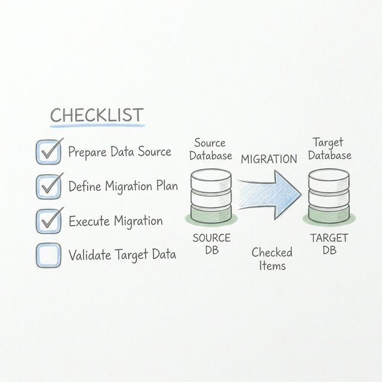
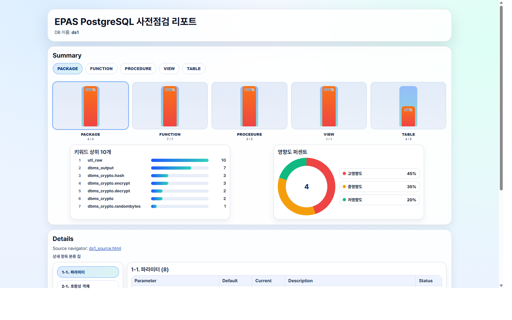

# EDBtoPG: EPAS to PostgreSQL Migration Precheck Tool

<p align="center">
  
</p>

## 개요
`EDBtoPG`는 EPAS(EnterpriseDB Advanced Server) 환경에서 PostgreSQL로 마이그레이션하기 전에
호환성 이슈를 사전 진단하고, 결과를 HTML/TSV 리포트로 생성하는 도구입니다.

## 주요 기능
- 파라미터 점검: 기본값 대비 현재값 비교 및 변경 영향 확인
- Oracle/EDB 호환 키워드 탐지: 객체 소스 내 주요 키워드 매칭
- 데이터 타입/객체 분석: `RAW`, `CLOB`, `BFILE` 등 점검
- 정책/고급 기능 점검: Synonym, RLS, Profile, Resource Group, DBLink
- 시각화 리포트: Summary/Details 카드, 상태 배지, 영향도 도넛 차트

## 요구 사항
- OS: Bash 실행 가능 환경
- DB Client: `psql`
- Optional: `python3` (특정 소스 하이라이팅 보조)

## 실행 방법
```bash
bash EPAS_PRECHECK/epas_precheck_v2.0.sh -d <DBNAME> -U <USER> -o ./out
```

### 자주 쓰는 옵션
- `-h, --host`: DB 호스트 (기본값 `localhost`)
- `-p, --port`: DB 포트 (기본값 `5444`)
- `-W, --password`: DB 비밀번호 (권장: 환경변수 `PGPASSWORD`)
- `-c, --compress`: `tar` 또는 `gz`
- `--connect-timeout`: 연결 타임아웃(초)

## 출력물 안내
출력 디렉터리에는 아래 파일이 생성됩니다.
- `<DBNAME>.html`: 최종 메인 리포트
- `<DBNAME>_source.html`: 소스 네비게이터 인덱스
- `<DBNAME>_sources/`: 객체별 소스 HTML
- `*.tsv`: 중간/분석 데이터

### 출력 샘플 (v2.0 최종 디자인)
<p align="center">
  
</p>

## 디자인 문서
- 최종 시안 문서: `design/README.md`
- 최종 프로토타입: `design/epas_precheck_v2.0_prototype.html`

## 참고
- 레거시 스크립트/SQL 백업: `EPAS_PRECHECK/.dummy/`
