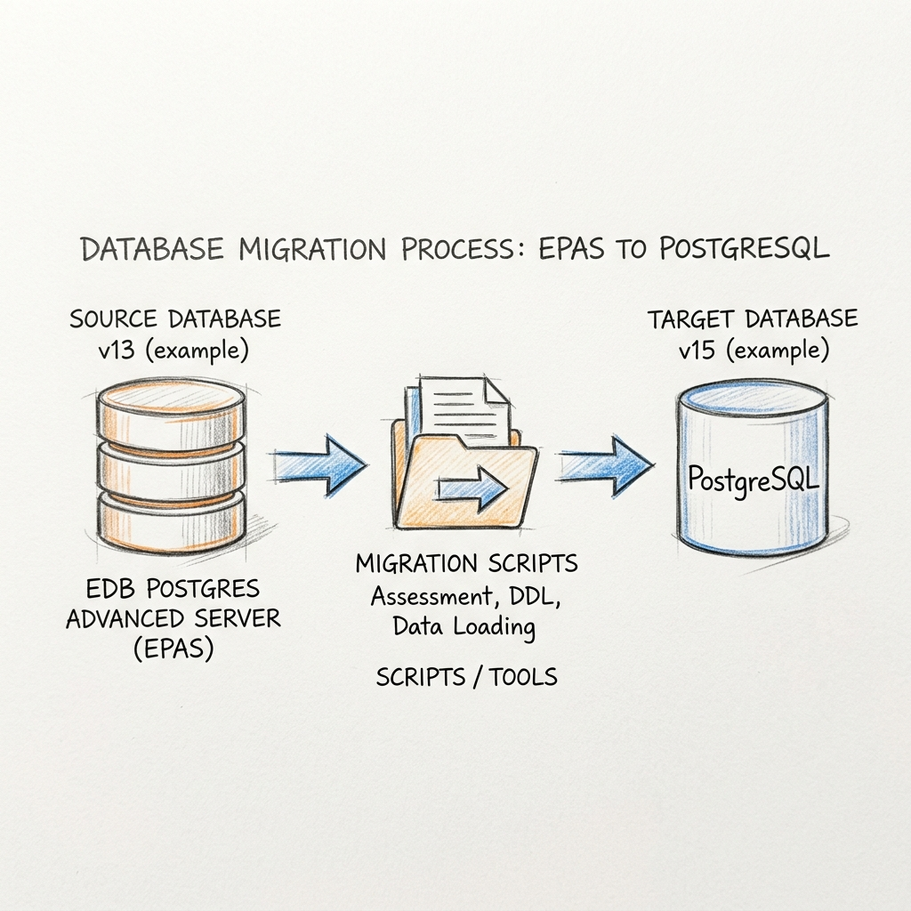
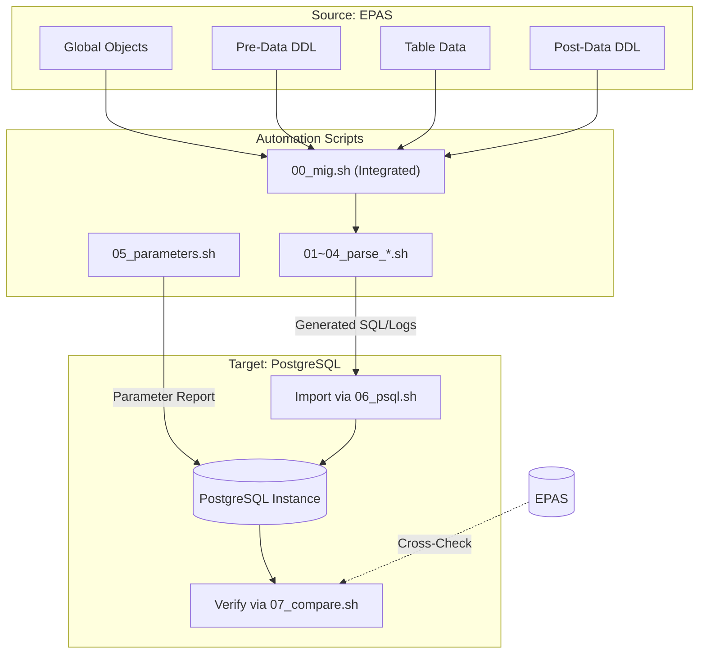
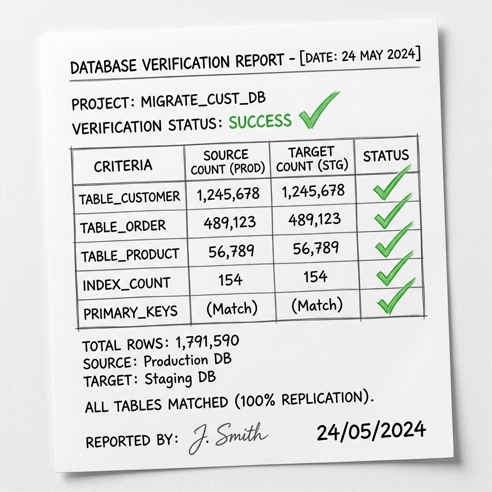

# EPAS to PostgreSQL Migration Guide

이 프로젝트는 EnterpriseDB(EPAS) 환경에서 Community PostgreSQL 환경으로 스키마, 데이터, 파라미터 설정을 안전하게 이관하고 검증하기 위한 자동화 스크립트 세트입니다.

---

## 1. 이관 프로세스 개요 (Migration Overview)

전체 이관 프로세스는 크게 **추출(Export)**, **설정(Configuration)**, **적재(Import)**, **검증(Verification)**의 4단계로 구성됩니다.

### 🎨 시각적 워크플로우


### 📊 상세 아키텍처 다이어그램


---

## 2. 주요 스크립트 구성 및 역할

| 스크립트명 | 역할 설명 | 주요 처리 내용 |
| :--- | :--- | :--- |
| `00_mig.sh` | **통합 이관 준비** | 01~05번 스크립트를 순차적으로 자동 실행 및 권한 체크 |
| `01_parse_global.sh` | **Global 객체 추출** | DB 전체 Role, Tablespace 정보 추출 및 DDL 생성 |
| `02_parse_pre_data.sh` | **Pre-Data DDL 추출** | Database, Schema, Table, Sequence, View 등 구조 추출 |
| `03_parse_data.sh` | **Data 추출** | 실제 테이블 데이터를 COPY 형태의 SQL로 추출 |
| `04_parse_post_data.sh` | **Post-Data DDL 추출** | Index, Constraint, Trigger 등 후행 객체 추출 |
| `05_parameters.sh` | **환경 설정 분석** | Source DB 파라미터 및 Extension 목록 리포트 생성 |
| `06_psql.sh` | **타겟 DB 이관 실행** | 추출된 DDL 및 데이터를 Target DB에 적재(Import) |
| `07_compare_objects.sh` | **데이터 검증** | 객체 수 및 Row Count 비교, 누락 데이터 샘플링 |

---

## 3. 표준 작업 절차 (Execution Flow)

### [STEP 1] 데이터 및 구조 추출
```bash
$ ./00_mig.sh
```
- Source DB에서 SQL 파일을 추출하여 `./postgres/` 디렉터리에 저장합니다.

### [STEP 2] 파라미터 및 환경 설정 반영
- `postgres/05_parameters_report.log`를 참조하여 Target DB의 `postgresql.conf` 및 Extension 설정을 수동으로 조정합니다.

### [STEP 3] 데이터 적재 (Import)
```bash
$ ./06_psql.sh
```
- 준비된 SQL 파일들을 Target PostgreSQL에 순차적으로 실행합니다.

### [STEP 4] 이관 최종 검증
```bash
$ ./07_compare_objects.sh
```
- 소스와 타겟의 정합성을 체크합니다.



---

## 4. 디렉터리 구조

```text
./
├── 00_mig.sh                 # 통합 실행 스크립트
├── 01~07_*.sh                # 단계별 개별 스크립트
├── images/                   # 가이드용 시각 자료 (Images)
└── postgres/                 # 추출 결과물 저장 디렉터리
     ├── 05_parameters_report.log       # 파라미터 분석 리포트
     ├── 07_migration_compare_report.log # 최종 정합성 검증 리포트
     └── removed/                       # 이관 제외 대상(EPAS 전용) 로그
```

---

## 5. 주의 사항
- **접속 정보 수정**: 모든 스크립트 상단의 IP, Port, User 정보를 반드시 실제 환경에 맞게 수정해야 합니다.
- **권한 확인**: 실행 전 스크립트에 실행 권한(`chmod +x *.sh`)이 있는지 확인하십시오.
- **EPAS 전용 객체**: `removed/` 디렉터리에 기록된 로그를 확인하여 EPAS 전용 패키지 등 PostgreSQL에서 지원하지 않는 객체가 있는지 체크하십시오.
