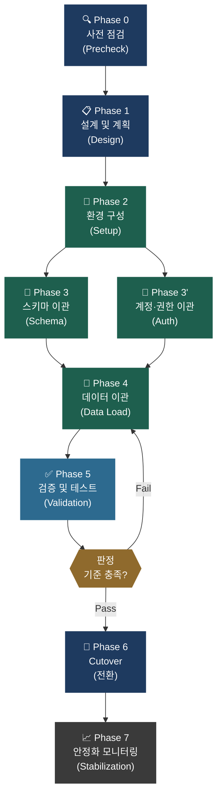
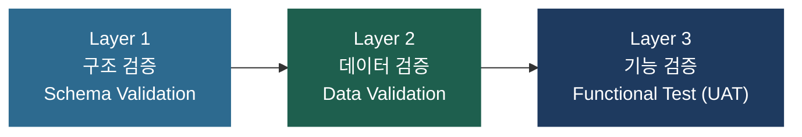

# EDB EPAS → PostgreSQL 마이그레이션 표준 프로세스 가이드

**문서 분류**: 비즈니스 제안 / 내부 기획  
**작성 기준**: `epas_precheck_v3.0.sh` 분석 결과 및 이관 계획서 전체 설계 기반  
**버전**: v1.0 (2026-04-02)

---

## Executive Summary

본 가이드는 EDB EPAS(EnterpriseDB Advanced Server) 환경에서 커뮤니티 기반의 표준 PostgreSQL로 전환하는 전체 마이그레이션 프로세스를 단계별로 정의합니다.

프로젝트는 총 **8단계(Phase 0 ~ 7)** 로 구성되며, 각 단계는 명확한 **산출물(Deliverable)** 및 **담당 주체**를 갖습니다. 호환성 선점검(Precheck) 결과를 기반으로 리스크를 사전에 정량화하여, 데이터 유실과 서비스 중단을 최소화하는 것이 본 프로세스의 핵심 목표입니다.

---

## 전체 마이그레이션 프로세스 흐름도

---

## 단계별 프로세스 상세 정의

### Phase 0 — 사전 점검 (Precheck)

| 항목 | 내용 |
| :--- | :--- |
| **목표** | 현재 EPAS 환경의 호환성 위험 요소를 정량적으로 파악 |
| **주요 활동** | `epas_precheck_v3.0.sh` 스크립트 실행 및 결과 분석 |
| **핵심 산출물** | `[DOC-1]` 호환성 분석 보고서 |
| **담당** | DB 마이그레이션 팀 |
| **판정 기준** | HIGH 위험 항목 목록 확정 및 이해관계자 공유 완료 |

---

### Phase 1 — 설계 및 계획 (Design)

| 항목 | 내용 |
| :--- | :--- |
| **목표** | 이관 범위, 방법론, 일정을 확정하고 전체 로드맵 수립 |
| **주요 활동** | DOC-2 ~ DOC-5 계획서 초안 작성, 이해관계자 리뷰 |
| **핵심 산출물** | `[DOC-2]` DB/유저, `[DOC-3]` 스키마, `[DOC-4]` 데이터, `[DOC-5]` PL/SQL 계획서 |
| **담당** | DB 마이그레이션 팀 + DBA/개발팀 협의 |
| **판정 기준** | 이관 범위 최종 확정 및 계획서 내부 승인 완료 |

---

### Phase 2 — 환경 구성 (Environment Setup)

| 항목 | 내용 |
| :--- | :--- |
| **목표** | 대상 PostgreSQL 서버 구성 및 접근 권한 설정 |
| **주요 활동** | PG 설치, 네트워크 연동, 스키마/계정 사전 생성 |
| **핵심 산출물** | 운영 환경 구성 완료 체크리스트 |
| **담당** | 인프라팀 + DBA팀 |
| **판정 기준** | 대상 DB 정상 접속 및 `pgloader`, `pgAudit` 등 확장 설치 완료 |

---

### Phase 3 — 스키마 · 계정·권한 이관 (Schema & Auth Migration)

| 항목 | 내용 |
| :--- | :--- |
| **목표** | 테이블/인덱스/뷰 DDL 및 사용자·권한을 PG 환경에 적용 |
| **주요 활동** | 비호환 DDL 변환(타입 교체, 표현식 수정), 계정 생성, Grant 재적용 |
| **핵심 산출물** | 변환된 DDL 스크립트, 계정/권한 이관 완료 보고서 |
| **담당** | DB 마이그레이션 팀 |
| **판정 기준** | 모든 테이블 생성 성공 및 오류 0건 |

---

### Phase 4 — 데이터 이관 (Data Migration)

| 항목 | 내용 |
| :--- | :--- |
| **목표** | 원천 EPAS의 모든 레코드를 대상 PG DB로 복제 |
| **주요 활동** | `pgloader` 를 통한 병렬 데이터 로드, LOB(CLOB) 별도 처리 |
| **핵심 산출물** | 테이블별 이관 건수 보고서 |
| **담당** | DB 마이그레이션 팀 |
| **판정 기준** | 이관 오류 건수 0, 전체 처리율 100% |

---

### Phase 5 — 검증 및 테스트 (Validation)

| 항목 | 내용 |
| :--- | :--- |
| **목표** | 데이터 정합성 및 애플리케이션 기능 정상 동작 확인 |
| **주요 활동** | COUNT(*) 검증, 샘플 데이터 비교, 성능 기준치(SLA) 테스트, UAT |
| **핵심 산출물** | 검증 결과 보고서 (Pass / Fail 판정) |
| **담당** | QA팀 + 사용자(UAT) |
| **판정 기준** | 데이터 오차 0건, 주요 기능 Pass, 응답속도 기준치 이내 |

---

### Phase 6 — Cutover (실서비스 전환)

| 항목 | 내용 |
| :--- | :--- |
| **목표** | 사전 계획된 일정에 따라 서비스 Database를 PG로 절체 |
| **주요 활동** | 원천 DB 쓰기 금지, 최종 증분 데이터 동기화, DNS/접속 정보 전환 |
| **핵심 산출물** | Cutover 체크리스트, 전환 완료 보고서 |
| **담당** | PM + DB 마이그레이션 팀 + 인프라팀 |
| **판정 기준** | 서비스 정상 동작 확인 및 롤백 대기 해제 |

---

### Phase 7 — 안정화 및 모니터링 (Stabilization)

| 항목 | 내용 |
| :--- | :--- |
| **목표** | 전환 후 이상 징후 조기 탐지 및 성능 최적화 |
| **주요 활동** | 운영 모니터링(CPU/메모리/쿼리 성능), 이슈 대응, VACUUM/ANALYZE 정기 수행 |
| **핵심 산출물** | 안정화 완료 보고서 (전환 후 4주) |
| **담당** | DBA팀 + 운영팀 |
| **판정 기준** | 4주간 P1 장애 0건, 기준 성능 유지 |

---

## 품질 보증 전략 (Quality Assurance)

마이그레이션의 정합성을 보장하기 위해 **3-Layer 검증 체계**를 적용합니다.

| 검증 레이어 | 주요 항목 | 합격 기준 |
| :---: | :--- | :--- |
| **Layer 1 — 구조** | 테이블/컬럼/인덱스/제약조건 수 일치 | 원천=대상, 오차 0건 |
| **Layer 2 — 데이터** | `COUNT(*)` 일치, 주요 컬럼 SUM/MAX 비교 | 오차율 0% |
| **Layer 3 — 기능** | 핵심 업무 시나리오 기반 UAT | 전체 TC `Pass` |

---

## 이관 프로젝트 담당자 매트릭스 (RACI)

| 단계 | PM | 마이그레이션팀 | DBA팀 | 개발팀 | QA팀 |
| :--- | :---: | :---: | :---: | :---: | :---: |
| Phase 0 사전점검 | A | **R** | C | - | - |
| Phase 1 설계 | A | **R** | C | C | - |
| Phase 2 환경구성 | A | C | **R** | - | - |
| Phase 3 스키마이관 | A | **R** | C | C | - |
| Phase 4 데이터이관 | A | **R** | C | - | I |
| Phase 5 검증 | A | C | C | C | **R** |
| Phase 6 Cutover | **R** | C | C | - | C |
| Phase 7 안정화 | A | I | **R** | - | - |

> `R`: Responsible (실행), `A`: Accountable (최종책임), `C`: Consulted (협의), `I`: Informed (통보)

---

*본 문서는 이관 프로젝트 킥오프(Kick-off) 단계에서 이해관계자에게 공유할 목적으로 작성되었습니다.*
